# Happy Birthday Banner

3D-printable **HAPPY BIRTHDAY** banner letters in the Waltograph UI (Disney-style) font.
Designed for the **Flashforge Adventurer 5X** but works on any FDM printer with a 200mm+ build height.

## Preview

### Holes Style
Holes punched directly into the letter body with reinforcement pads:

| H | A | P | P | Y |
|---|---|---|---|---|
| 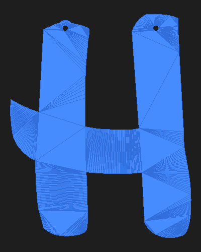 | 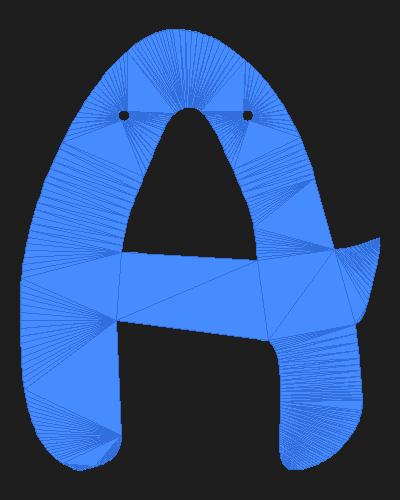 |  |  |  |

| B | I | R | T | H | D | A | Y |
|---|---|---|---|---|---|---|---|
| 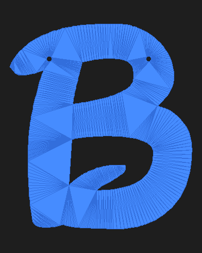 | 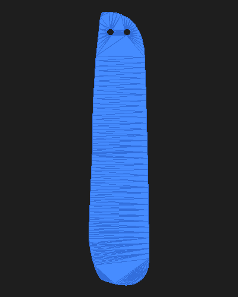 | 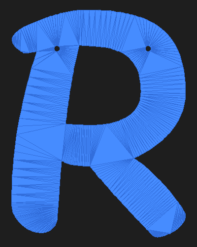 | 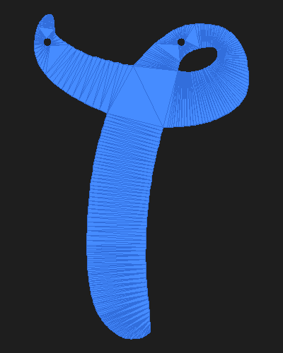 |  |  |  |  |

### Tabs Style
Rounded tabs extending above each letter with holes for stringing:

| H | A | P | P | Y |
|---|---|---|---|---|
| 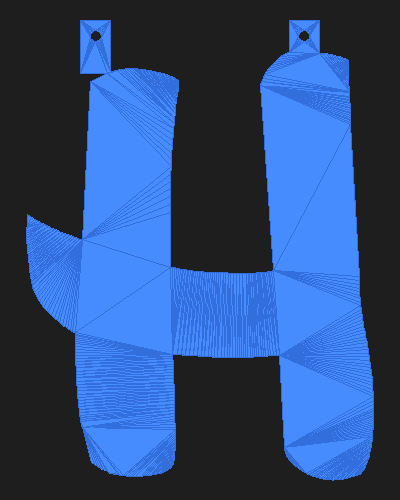 | 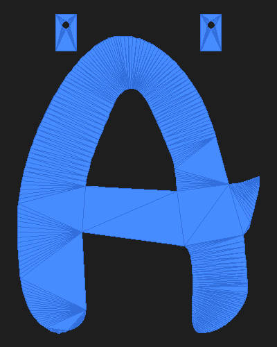 | 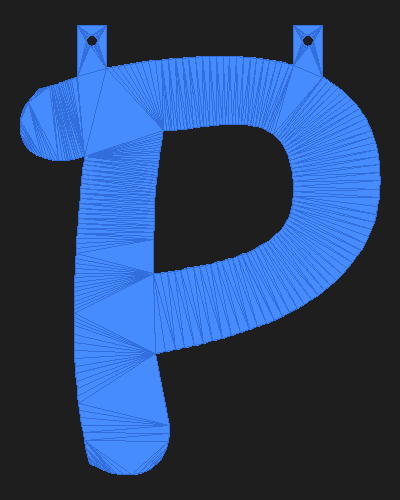 |  | 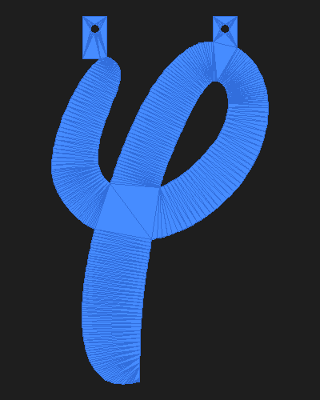 |

| B | I | R | T | H | D | A | Y |
|---|---|---|---|---|---|---|---|
|  | 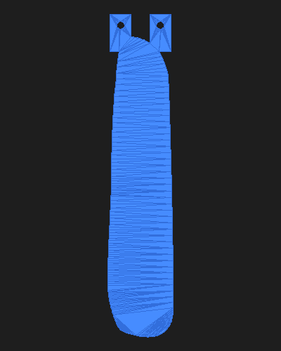 | 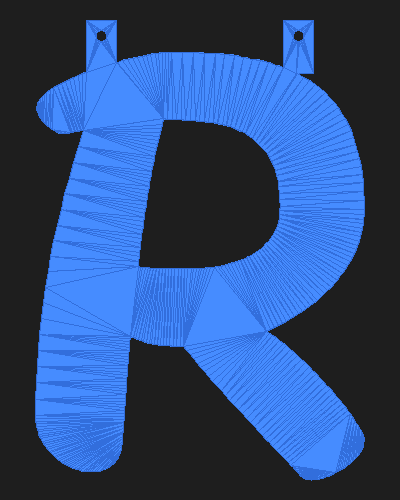 |  |  |  |  |  |

## Specifications

| Parameter | Value |
|-----------|-------|
| Letter height | 200mm |
| Depth (thickness) | 1.0mm |
| Hole diameter | 5mm |
| Min edge clearance | 2mm from hole edge to letter edge |
| Font | Waltograph UI (included in `fonts/`) |
| Tab height (tabs style) | 15mm above letter + 10mm overlap into letter |
| Tab width | 14mm with 3mm rounded corners |

## STL Files

Two styles are provided in separate folders:

- **`STL/holes/`** - 5mm holes punched directly into the letter body with 7mm reinforcement pads
- **`STL/tabs/`** - Rounded tabs extending above each letter with 5mm holes centered in the tabs

### Print Quantities

9 unique letter STL files, printed multiple times as needed:

| Letter | Quantity | STL File |
|--------|----------|----------|
| A | 2x | `A_banner.stl` |
| B | 1x | `B_banner.stl` |
| D | 1x | `D_banner.stl` |
| H | 2x | `H_banner.stl` |
| I | 1x | `I_banner.stl` |
| P | 2x | `P_banner.stl` |
| R | 1x | `R_banner.stl` |
| T | 1x | `T_banner.stl` |
| Y | 2x | `Y_banner.stl` |
| **Total** | **13 prints** | |

## Print Settings (Flashforge AD5X)

| Setting | Value |
|---------|-------|
| Layer height | 0.2mm (5 layers total) |
| Infill | 100% (solid - only 1mm thick) |
| Supports | None needed (flat print) |
| Material | PLA, PETG, or ABS |

The widest letter (B) is ~178mm, which fits within the AD5X's 305mm build plate.

## Assembly

Thread a ribbon or string through the holes at the top of each letter to hang the banner.
Letters with two separate strokes at the top (like H) have one hole per stroke for balanced hanging.

## Regenerating STLs

The `generate_banner.py` script can regenerate all STL files. Requirements:

```bash
pip install numpy-stl trimesh shapely fonttools triangle
python generate_banner.py
```

The script uses geometry-aware hole placement:
- Erodes the letter polygon to guarantee minimum 2mm clearance from all edges
- Detects multi-stroke letter tops (like H) and places one hole per stroke
- Distinguishes real gaps from decorative thin spots in the font

## Font

The Waltograph UI font by Justin Callaghan is included in `fonts/waltographUI.ttf`.
It is a free fan-made Disney-style font.
