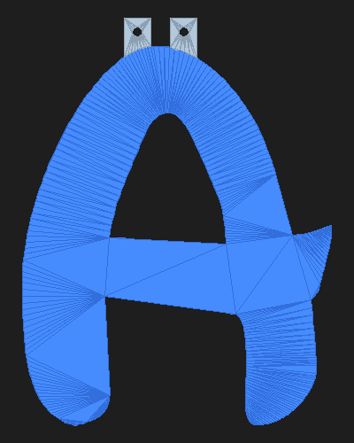
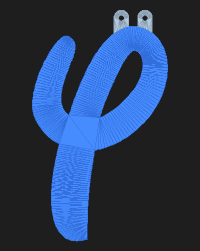
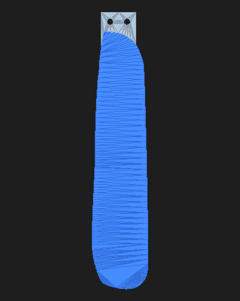
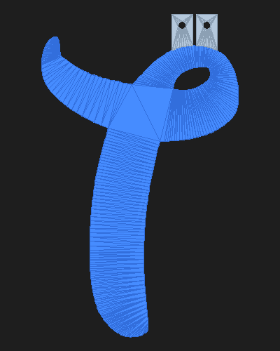
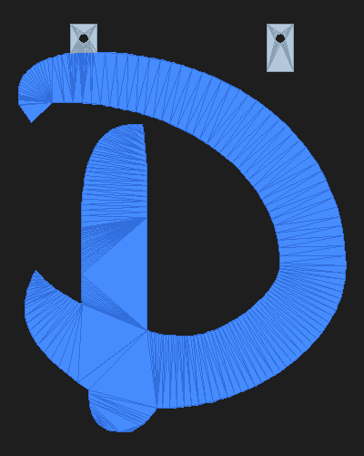
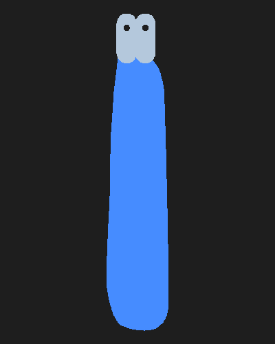
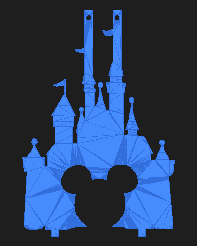

# Happy Birthday Banner

3D-printable **HAPPY BIRTHDAY** banner letters in the Waltograph UI (Disney-style) font,
with a Disney castle separator between the words.
Designed for the **Flashforge Adventurer 5X** (with IFS multi-material support)
but works on any FDM printer with a 200mm+ build height.

## Preview

### Holes Style
Holes punched directly into the letter body with reinforcement pads.
All holes aligned at Y=185mm so the banner hangs level:

| H | A | P | P | Y |
|---|---|---|---|---|
|  |  |  |  |  |

| B | I | R | T | H | D | A | Y |
|---|---|---|---|---|---|---|---|
|  |  |  |  |  |  |  |  |

### Tabs Style
Dome-topped tabs extending above each letter with holes for stringing (semicircular top for clean FDM printing).
Available as single-material STL or multi-material 3MF (body + tabs as separate colors):

| H | A | P | P | Y |
|---|---|---|---|---|
|  |  |  |  |  |

| B | I | R | T | H | D | A | Y |
|---|---|---|---|---|---|---|---|
|  |  |  |  |  |  |  |  |

### Snap-fit Style
Separate letter body and tab pieces joined with a rabbet joint and Mickey head
peg-and-pocket lock. Body is 3mm thick with a stepped cutout on the back. Tab has
a matching stepped profile (3mm body, 1mm shelf) with a Mickey peg that locks into
the pocket. Print body and tabs in different colors, press-fit together with glue:

| H | A | P | P | Y |
|---|---|---|---|---|
|  |  |  |  |  |

| B | I | R | T | H | D | A | Y |
|---|---|---|---|---|---|---|---|
|  |  |  |  |  |  |  |  |

### Castle Separator

Goes between HAPPY and BIRTHDAY on the string:

| Holes | Tabs |
|---|---|
|  |  |

## Specifications

| Parameter | Value |
|-----------|-------|
| Letter height | 200mm |
| Depth (thickness) | 1.0mm |
| Hole diameter | 5mm |
| Hole Y position | 185mm (uniform across all letters) |
| Min edge clearance | 2mm from hole edge to letter edge |
| Font | Waltograph UI (included in `fonts/`) |
| Tab height | 15mm above letter + 10mm overlap into body |
| Tab width | 14mm with semicircular dome top |
| Snap-fit body depth | 3.0mm (1mm face + 1mm pocket + 1mm cutout) |
| Snap-fit tab | 3mm body, 1mm shelf in overlap + 1mm Mickey peg |
| Mickey peg width | ~5mm (head) + ~3mm ears |
| Pocket tolerance | 0.2mm oversize for clearance |
| Vent hole | 1.5mm diameter pinhole in pocket back |

## File Formats

| Folder | Description |
|--------|-------------|
| `STL/holes/` | Single-material STL with holes in the letter body |
| `STL/tabs/` | Single-material STL with tabs on top |
| `STL/multi-color/` | Split STLs (`_body.stl` + `_tabs.stl`) for manual material assignment |
| `STL/snap-fit/` | Separate body (`_snap_body.stl`) and tab (`_snap_tab.stl`) with Mickey peg joints |
| `3MF/` | Multi-material 3MF with body and tabs as separate material groups |

For the AD5X with IFS: import the 3MF files into Orca-FlashForge for automatic
extruder assignment (e.g. letter body in color, tabs in clear/transparent).

For snap-fit: print body and tabs separately in different colors. The tab's 1mm
shelf sits in the letter's rabbet cutout, and the Mickey peg locks into the pocket.
Add a dab of glue for permanence.

## Print Quantities

9 unique letters + 1 castle separator:

| Letter | Quantity | File |
|--------|----------|------|
| A | 2x | `A_banner` |
| B | 1x | `B_banner` |
| D | 1x | `D_banner` |
| H | 2x | `H_banner` |
| I | 1x | `I_banner` |
| P | 2x | `P_banner` |
| R | 1x | `R_banner` |
| T | 1x | `T_banner` |
| Y | 2x | `Y_banner` |
| Castle | 1x | `castle_banner` |
| **Total** | **14 prints** | |

## Print Settings (Flashforge AD5X)

| Setting | Value |
|---------|-------|
| Layer height | 0.2mm (5 layers total) |
| Infill | 100% (solid - only 1mm thick) |
| Supports | None needed (flat print) |
| Material | PLA, PETG, or ABS |
| Multi-color | IFS with Orca-FlashForge and 3MF files |

The widest letter (B) is ~178mm, fitting within the AD5X's 220x220mm build plate.

## Assembly

Thread ribbon or string through the holes at the top of each piece.
The castle separator goes between HAPPY and BIRTHDAY.
All holes are at the same Y height (185mm) so letters hang level.

## Regenerating

```bash
pip install numpy-stl trimesh shapely fonttools triangle lib3mf
python generate_banner.py     # letters (STL, 3MF, split STL)
python adapt_castle.py        # castle separator
```

## Castle Separator

The Disney castle with Mickey head cutout is adapted from a [cake topper STL on Creality Cloud](https://www.crealitycloud.com/model-detail/disney-castle-cake-topper)
(`disney_castle_mickey_head.stl`). The `adapt_castle.py` script extracts the
2D outline, removes the cake topper spike, scales to 200mm tall, and adds
holes on the two central towers for stringing.

## Font

Waltograph UI by Justin Callaghan, included in `fonts/waltographUI.ttf`.
Free fan-made Disney-style font.
